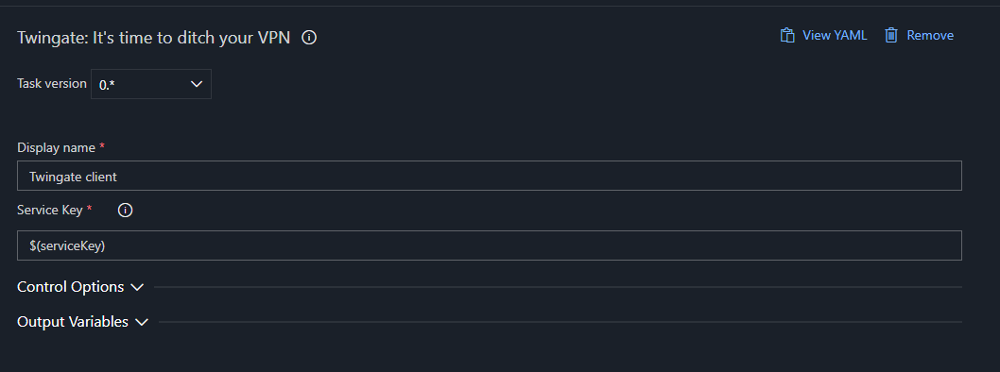

# Twingate
---
An Azure DevOps extension to connect to [Twingate](https://www.twingate.com/) networks to allow secure access to your resources from your pipelines.

Now supports both Windows and Linux based agents.

## Installation
1. Install the extension from the [Visual Studio Marketplace](https://marketplace.visualstudio.com/items?itemName=corestream.twingate).
2. Add the Twingate task to your pipeline.

## Requirements
Only supports Linux agents.

## Configuration
The Twingate task requires the following parameters:
- **serviceKey**: A base64 encoded string of the Twingate service key.

## Usage
Add the Twingate task to your pipeline and configure the required parameters. The task will connect to the Twingate network and allow secure access to your resources.

### Yaml
```yaml
steps:
- task: twingate@1
  displayName: 'Twingate client'
  inputs:
    serviceKey: ${{ parameters.serviceKey }}
```

### Classic


